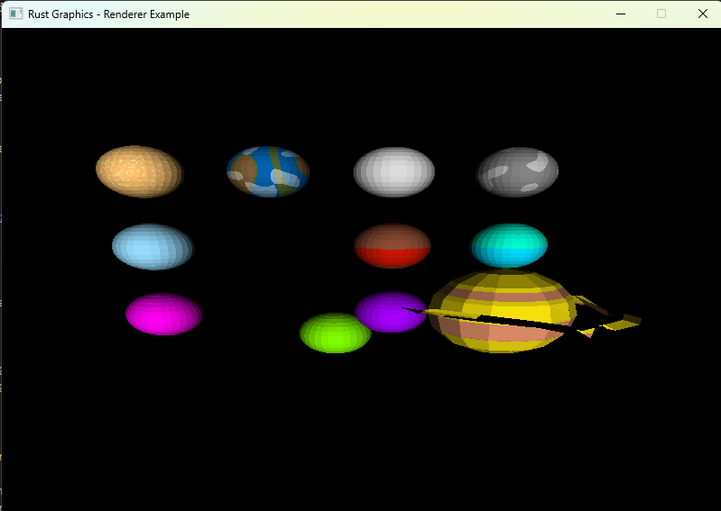

# Laboratorio4-GraficasXComputadoras

Lab 4: Shaders

``git clone https://github.com/BrandonReyes0609/Laboratorio4-GraficasXComputadoras.git``

``cd Laboratorio4-GraficasXComputadoras``

## Códigos importantes

``cargo run``

``cargo build --release``

``./target/release/codigo``

